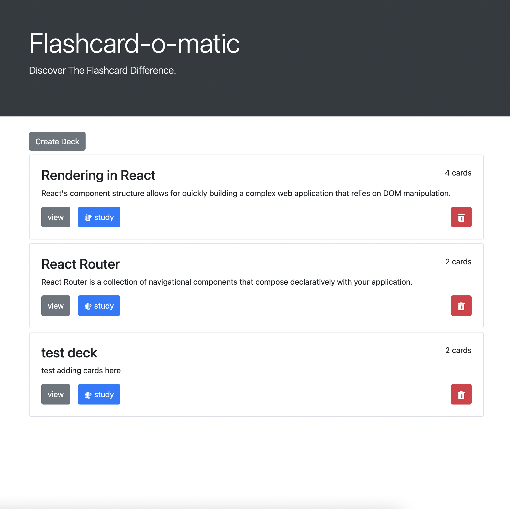

# Flashcard-O-Matic
  
## Description
A study tool that allows users to create and edit digital flashcards and sore them in decks. When ready, users can enter "study" mode, where they can flip the card's front and back side and move back and forth between cards seamlessly. The app saves all deck info in a .json file which allows for quick tranfering to word documents for printing. 
## Contents
* [Usage](#usage)
   * [Screenshots](#screenshots)
* [Built With](#built-with)
* [Questions](#questions)

## Usage
clone the repo into your machine, run npm i then npm start.  
  
### Screenshots

## Built With

* HTML
* CSS
* JavaScript
* Node.js
* React Js
  
## Questions
If you have any questions about the repo, please [open an issue](https://github.com/Oscarlosg/Flashcard-O-Matic/issues) or contact me via email at oscarlosg14@gmail.com. You can find more of my work on my GitHub, [Oscarlosg](https://github.com/Oscarlosg/).
  
